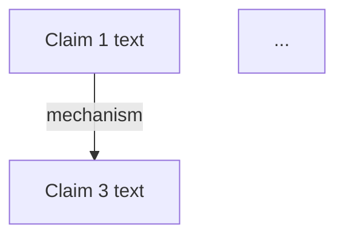

# Dissect — Argument Red Team

Decompose text into atomic claims, map stated causal links, surface potential biases and counter-evidence for human review. **You are the prosecutor, not the judge. Present challenges — the user decides.**

## Modes

| Mode | Stages | When |
|------|--------|------|
| Quick (default) | 1-3 | Standard analysis, LLM only |
| Deep | 1-4 | User says "dissect deep", asks for evidence, or text makes extraordinary claims |

## Pipeline

### Stage 1: Claim Decomposition

Extract atomic claims from input text into a structured table.

Each claim gets:
- **Type**: FACT (verifiable) / ASSUMPTION (taken as given) / PREDICTION (future-facing) / OPINION (subjective)
- **Confidence**: 0.0-1.0 based on how well-supported it is within the text
- **Source**: verbatim sentence from original text

Rules:
- One idea per claim. Split compound statements.
- "Everyone knows X" = ASSUMPTION, not FACT
- Predictions without basis = low confidence
- Strip rhetorical framing, keep core assertion
- Aim for 10-30 claims depending on text length

### Stage 2: Causal Link Inference

For each plausible pair of claims, determine if a causal relationship is stated or implied.

Required fields per edge:
- **Mechanism**: HOW cause produces effect. Quality gates:
  - FLAG if < 10 characters (weak mechanism)
  - FLAG if it merely restates the claims
  - Note whether mechanism is demonstrated or assumed
- **Direction**: A->B, B->A, or bidirectional
- **Strength**: author's implied strength, clamped to [0.1, 0.95]
- **Causal type**: direct / indirect / probabilistic / enabling / inhibiting / triggering

### Stage 3: Challenge Scan

For each causal edge, scan for potential issues from this checklist. **Flag for human review — do not penalize or adjust strengths.**

| # | Challenge | What to flag |
|---|-----------|-------------|
| 1 | Correlation vs causation | Is the mechanism demonstrated or just assumed? |
| 2 | Survivorship bias | Are only successes cited? What failures are invisible? |
| 3 | Narrative fallacy | Does this story only work in hindsight? |
| 4 | Anchoring | Is a salient number doing too much persuasive work? |
| 5 | Reverse causality | Could the arrow plausibly run the other way? |
| 6 | Selection bias | Is the evidence cherry-picked? What's missing? |
| 7 | Ecological fallacy | Are group-level stats applied to individuals? |
| 8 | Confirmation bias | Is only one side of evidence cited? |

For each flag: state the specific concern in 1-2 sentences. Do NOT assign severity scores or calculate penalties — that's false precision from an LLM judging another LLM.

### Stage 4: Counter-Evidence Search (deep mode only)

For each of the top 3 strongest causal claims:

1. **Supporting search**: WebSearch for evidence supporting the mechanism
2. **Contradicting search**: WebSearch for evidence AGAINST the mechanism
3. **Present both sides** to the user with source links

Do NOT compute composite scores. Present the evidence; let the user weigh it.

## Output Format

```
## Claims ([N] extracted)

| # | Claim | Type | Confidence |
|---|-------|------|------------|
| 1 | ... | FACT | 0.85 |

## Argument Structure



## Challenge Flags

| Edge | Potential Issues | Question for Reader |
|------|-----------------|-------------------|
| C1->C3 | Reverse causality possible | Could C3 actually cause C1? |

## Counter-Evidence (deep mode)

| Claim | Supporting | Contradicting |
|-------|-----------|---------------|
| C1->C3 | [source1] | [source2] |

## Open Questions

- [Questions the text doesn't answer that would change the conclusion]
- [Assumptions that were NOT tested]
- [What would have to be true for the opposite conclusion to hold?]
```

## What This Skill Is NOT

| Dissect is | Dissect is NOT |
|------------|---------------|
| A red team tool | A judge or arbiter of truth |
| A prosecutor presenting challenges | A jury rendering verdicts |
| An assumption-surfacer | A bias-severity calculator |
| An evidence retriever | An evidence scorer |
| A structure mapper | A causal inference engine |

**The user is always the judge.** Dissect finds the questions worth asking — the user decides the answers.
